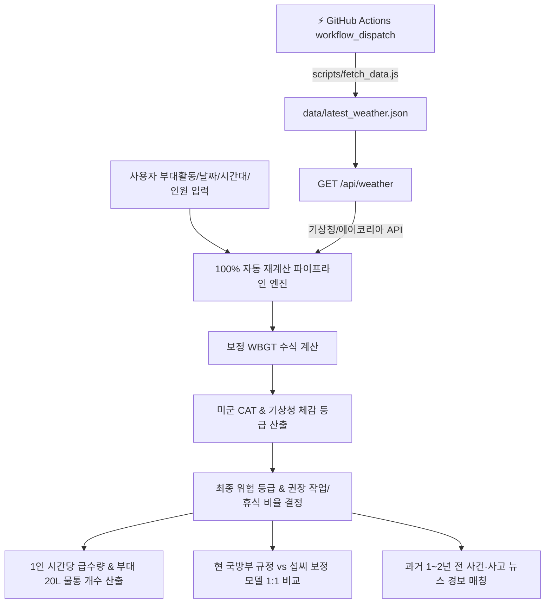

# 🪖 군 훈련 온열/환경위험 예측 및 부대활동 사전 계획 지원 시스템
> **Military Heat & Environmental Risk Prediction & Operational Pre-Planning System**

본 프로젝트는 미 육군성/공군 공동 교리 **TB MED 507 (Heat Stress Control and Heat Casualty Management, 2022 개정판)** 및 **DAFI 48-151 (Thermal Stress Program)**의 섭씨(°C) 보정 공식을 기반으로, 기상청 단기예보 API, 에어코리아 대기오염 API, 군 사건·사고 안전 뉴스를 통합하여 부대 훈련 사전 위험도를 자동 예측하고 필요한 급수량/준비물을 정밀 산출하는 알고리즘 엔진입니다.

---

## 1. 시스템 아키텍처 및 데이터 흐름도



---

## 2. 핵심 계산 알고리즘 및 과학적 보정 수식

### 2.1 온열지수(WBGT) 복장 보정 공식 (Clothing Adjustment Value, CAV)
단순 기온이나 실외 측정 WBGT 지수는 방탄복, 군장, 화생방 보호의 착용 시 장병 체내 열축적 효과를 반영하지 못합니다. 본 시스템은 미 공군 **DAFI 48-151 Table 3.2** 및 미 육군 **TB MED 507 Table 3-2 Note 7** 기준 섭씨(°C) 보정치를 합산합니다.

$$w_C = WBGT_{raw} + Adj_{gear}(Task)$$

#### 복장별 섭씨 보정치 ($Adj_{gear}$)
1. **전투복 / 체육복 (`scu`)**: $+0.0^\circ\text{C}$ (기준 복장, 보정 없음)
2. **방탄복 · 전투조끼 (`iba`)**: $+2.8^\circ\text{C}$ ($+5.0^\circ\text{F}$ 가산, DAFI 48-151 표 3.2)
3. **화생방 보호의 (`cbrn`, MOPP 4단계)**:
   - 경작업 (Easy Task, $\le 250\text{W}$): $+5.6^\circ\text{C}$ ($+10.0^\circ\text{F}$ 가산)
   - 중등작업/중작업 (Moderate/Heavy Task, $> 250\text{W}$): $+11.1^\circ\text{C}$ ($+20.0^\circ\text{F}$ 가산)

---

### 2.2 부대활동별 과업 대사량 (Metabolic Task Rates)
부대 훈련 과업에 따른 신체 열생산량(W)을 4가지 수준으로 정량화하여 작업/휴식 비율 산정 기준으로 사용합니다.

| 과업 등급 ID | 과업명 | 대사량 (W) | 대표 훈련 과업 예시 |
| :--- | :--- | :---: | :--- |
| `easy` | 경작업 | $\le 250\text{ W}$ | 총기 손질, 영점 사격자세, 제식 훈련, 실내/그늘 강의 |
| `mod` | 중등작업 | $\approx 425\text{ W}$ | 30lb 부하 정찰, 전술 포복, 진지 구축, 경계 훈련 |
| `heavy` | 중작업 | $\approx 600\text{ W}$ | 45lb 완전군장 행군, 4인 들것 환자 수송, 야외 구보 |
| `vhard` | 고강도 | $\approx 800\text{ W}$ | 3km 뜀걸음 체력측정, 장애물/유격 코스, 2인 들것 고속 수송 |

---

### 2.3 미 육군 TB MED 507 섭씨 카테고리 (Heat Categories)
보정된 WBGT 수치 ($w_C$)에 따라 미 육군 온열 위험 카테고리(CAT 1 ~ CAT 5)를 분류합니다.

| 미군 등급 | 표시 명칭 | 보정 WBGT 조건 ($w_C$) |
| :---: | :--- | :--- |
| **CAT 0** | 해당 없음 | $w_C < 25.6^\circ\text{C}$ |
| **CAT 1** | CAT 1 백색 | $25.6^\circ\text{C} \le w_C < 27.8^\circ\text{C}$ |
| **CAT 2** | CAT 2 녹색 | $27.8^\circ\text{C} \le w_C < 29.4^\circ\text{C}$ |
| **CAT 3** | CAT 3 황색 | $29.4^\circ\text{C} \le w_C < 31.1^\circ\text{C}$ |
| **CAT 4** | CAT 4 적색 | $31.1^\circ\text{C} \le w_C < 32.2^\circ\text{C}$ |
| **CAT 5** | CAT 5 흑색 | $w_C \ge 32.2^\circ\text{C}$ |

---

### 2.4 기상청 체감온도 및 최종 채택 위험 등급 (Adopted Risk Level)

#### 기상청 체감온도 등급 ($KL$)
- 관심 (1단계): $31.0^\circ\text{C} \le App < 33.0^\circ\text{C}$
- 주의 (2단계): $33.0^\circ\text{C} \le App < 35.0^\circ\text{C}$
- 경고 (3단계): $35.0^\circ\text{C} \le App < 38.0^\circ\text{C}$
- 위험 (4단계): $App \ge 38.0^\circ\text{C}$

#### 최종 통제 등급 산출 수식
기상청 체감온도 경보 단계와 미군 TB MED 507 섭씨 보정 CAT 등급 중 **더 높은 보수적 위험 수치**를 최종 채택합니다.

$$\text{Final\_Level} = \max(KL, CAT)$$

---

### 2.5 권장 작업/휴식 비율 및 1인 급수량 (Work/Rest Ratio & Water Intake)

TB MED 507 Table 3-2에 지정된 쿼트(Qt/hr) 기준 수량을 섭씨 및 리터(L/hr) 단위로 정밀 변환합니다. ($1\text{ Qt} = 0.946353\text{ L}$)

| 최종 등급 | 과업 강도 (`easy`) | 과업 강도 (`mod`) | 과업 강도 (`heavy`) | 과업 강도 (`vhard`) |
| :---: | :---: | :---: | :---: | :---: |
| **CAT 1** | 제한 없음 ($0.47\text{L}$) | 제한 없음 ($0.71\text{L}$) | 40분 작업 / 20분 휴식 ($0.71\text{L}$) | 20분 작업 / 40분 휴식 ($0.95\text{L}$) |
| **CAT 2** | 제한 없음 ($0.47\text{L}$) | 제한 없음 ($0.71\text{L}$) | 30분 작업 / 30분 휴식 ($0.95\text{L}$) | 15분 작업 / 45분 휴식 ($0.95\text{L}$) |
| **CAT 3** | 제한 없음 ($0.71\text{L}$) | 제한 없음 ($0.71\text{L}$) | 30분 작업 / 30분 휴식 ($0.95\text{L}$) | 10분 작업 / 50분 휴식 ($0.95\text{L}$) |
| **CAT 4** | 제한 없음 ($0.71\text{L}$) | 50분 작업 / 10분 휴식 ($0.71\text{L}$) | 20분 작업 / 40분 휴식 ($0.95\text{L}$) | 10분 작업 / 50분 휴식 ($0.95\text{L}$) |
| **CAT 5** | 제한 없음 ($0.95\text{L}$) | 20분 작업 / 40분 휴식 ($0.95\text{L}$) | 15분 작업 / 45분 휴식 ($0.95\text{L}$) | 10분 작업 / 50분 휴식 ($0.95\text{L}$) |

---

### 2.6 부대 전체 총 소요 식수량 및 20L 물통 개수 산출 공식

계획 훈련 시간대 $[H_{start}, H_{end}]$ 및 참가 인원 수 $Pax$에 따른 부대 식수 수량 산출 수식입니다.

$$\text{Total\_Liters} = \left( \sum_{h=H_{start}}^{H_{end}-1} \text{Quarts}(h) \right) \times 0.946353 \times Pax$$

$$\text{Total\_20L\_Containers} = \left\lceil \frac{\text{Total\_Liters}}{20} \right\rceil$$

---

### 2.7 현장 실측 WBGT 입력 및 선형 보간 알고리즘 (Linear Interpolation)

시간대별 실측 데이터가 일부만 입력된 경우, 인접한 실측 시각 $lo$와 $hi$ ($lo < i < hi$) 사이의 미입력 시각 $i$에 대해 선형 보간 수식을 적용합니다.

$$t = \frac{i - lo}{hi - lo}$$

$$V_i = V_{lo} + (V_{hi} - V_{lo}) \times t$$

---

## 3. 데이터 구조 및 인터페이스 명세

### 3.1 주요 10대 부대활동 마스터 DB (`UNIT_ACTIVITIES`)
```javascript
const UNIT_ACTIVITIES = [
  { id: "act_range",    name: "🎯 사격 훈련",      task: "easy",  gear: "iba",  pax: 240 },
  { id: "act_fitness",  name: "🏃 체력 측정",      task: "vhard", gear: "scu",  pax: 300 },
  { id: "act_march10",  name: "🎒 10km 급속행군",   task: "heavy", gear: "iba",  pax: 450 },
  { id: "act_march40",  name: "⚔️ 40km 전술행군",   task: "heavy", gear: "iba",  pax: 600 },
  { id: "act_gaekae",   name: "💥 각개전투 / 포복", task: "mod",   gear: "iba",  pax: 350 },
  { id: "act_cbrn",     name: "☣️ 화생방 제독",     task: "mod",   gear: "cbrn", pax: 180 },
  { id: "act_obstacle", name: "🧗 유격 / 장애물",   task: "vhard", gear: "scu",  pax: 280 },
  { id: "act_grenade",  name: "🔫 수류탄 투척",    task: "easy",  gear: "iba",  pax: 320 },
  { id: "act_jesik",    name: "🚶 제식 / 총기손질", task: "easy",  gear: "scu",  pax: 500 },
  { id: "act_custom",   name: "⚙️ 사용자 직접설정", task: "heavy", gear: "iba",  pax: 240 }
];
```

### 3.2 서버리스 API 엔드포인트 명세 (`/api/weather`)
- **Method**: `GET`
- **Response Format**: `JSON`
- **Output Schema**:
```json
{
  "status": "LIVE_KMA_DATA",
  "location": "충청남도 논산시 연무대읍 (육군훈련소)",
  "env": {
    "ta": 33.2,
    "rh": 68,
    "ws": 2.1,
    "chillTemp": 34.5,
    "wbgt": 31.8,
    "pm10": 42,
    "pm25": 22,
    "dustStatus": "보통",
    "uvIndex": 8,
    "pop": 10
  },
  "data": {
    "ta": [26.1, 26.5, 27.8, 29.5, 31.2, 32.8, 34.1, 35.0, 35.8, 36.2, 35.9, 35.0, 33.6, 31.8, 30.0, 28.6, 27.6],
    "rh": [82, 80, 76, 70, 63, 57, 52, 48, 45, 44, 45, 48, 53, 59, 66, 72, 77],
    "app": [28.0, 28.5, 30.1, 32.0, 33.9, 35.4, 36.6, 37.4, 38.1, 38.5, 38.2, 37.4, 36.1, 34.3, 32.5, 30.9, 29.6],
    "wbgt": [24.0, 24.5, 25.8, 27.2, 28.6, 29.8, 30.8, 31.5, 32.0, 32.3, 32.0, 31.2, 30.0, 28.4, 26.8, 25.5, 24.6]
  },
  "news": [
    {
      "id": "news_1",
      "category": "act_march40",
      "title": "[안전주의] 혹서기 전술행군 중 열탈진 장병 발생 사례 및 지휘관 조치사항",
      "source": "국방일보 안전보도",
      "snippet": "기온 32도 이상의 고온 다습 환경에서 완전군장 행군 시 15분 단위 휴식 및 냉각 구역 운영 필수...",
      "url": "https://korea.kr",
      "date": "2025-07-14"
    }
  ]
}
```

---

## 4. 백그라운드 데이터 수집 파이프라인 (GitHub Actions)

### 4.1 워크플로우 구성 (`.github/workflows/fetch_weather.yml`)
- **Triggers**:
  - `workflow_dispatch`: 프론트엔드 `[⚡ GitHub Actions 기상 수집]` 버튼 클릭 시 즉시 수집
  - `schedule`: `cron: '0 */3 * * *'` (매 3시간마다 백그라운드 자동 수집)
- **Execution Script**: `node scripts/fetch_data.js`
- **Output Artifact**: `data/latest_weather.json` 업데이트 후 자동 커밋/푸시 또는 메모리 세션 동기화

### 4.2 GitHub API 트리거 엔드포인트 (`/api/trigger-action`)
- **Method**: `POST`
- **Function**: GitHub REST API `POST /repos/{owner}/{repo}/dispatches` 호출하여 워크플로우를 트리거하고 최신 파이프라인 결과를 프론트엔드로 리턴합니다.

---

## 5. 프로젝트 소스 파일 디렉토리 구조

```
weather_contest/
├── .github/
│   └── workflows/
│       └── fetch_weather.yml     # GitHub Actions 백그라운드 데이터 수집 워크플로우
├── api/
│   ├── weather.js                # 기상청/에어코리아/뉴스 데이터 제공 서버리스 API
│   └── trigger-action.js         # GitHub Actions workflow_dispatch 트리거 프록시 API
├── data/
│   └── latest_weather.json       # 기상 파이프라인 수집 데이터 저장소
├── scripts/
│   └── fetch_data.js             # Node.js 수집 파이프라인 스크립트
├── index.html                    # 단일 지휘 통제 대시보드 마크업
├── styles.css                    # 통합 스타일시트
├── app.js                        # 코어 기상 수식 연산 및 실시간 반응형 인터랙션 스크립트
├── .env                          # API 키 설정 파일 (DATA_GO_KR_KEY, KMA_API_HUB_KEY)
└── README.md                     # 기술 스펙 및 개발자 문서
```

---

## 6. 현 국방부 규정 vs 섭씨 보정 모델 판정 로직 비교

| 구분 | 현 국방부 규정 (`현기준.md`) | 본 보정 예측 모델 (TB MED 507 / DAFI 48-151) |
| :--- | :--- | :--- |
| **평가 지표** | 단일 측정 온도지수 ($WBGT_{raw}$) | 보정 온도지수 ($w_C = WBGT_{raw} + Adj_{gear}$) |
| **과업 강도** | 미반영 (단일 수치 적용) | 4단계 대사량 반영 (250W / 425W / 600W / 800W) |
| **복장 보정** | 미반영 (전투복 단일 기준) | 전투복($+0^\circ\text{C}$), 방탄복($+2.8^\circ\text{C}$), 보호의($+11.1^\circ\text{C}$) |
| **수분 보급** | 일률적 급수 조치 | 과업/등급별 1인 시간당 급수량(L) & 20L 물통 개수 정밀 산출 |